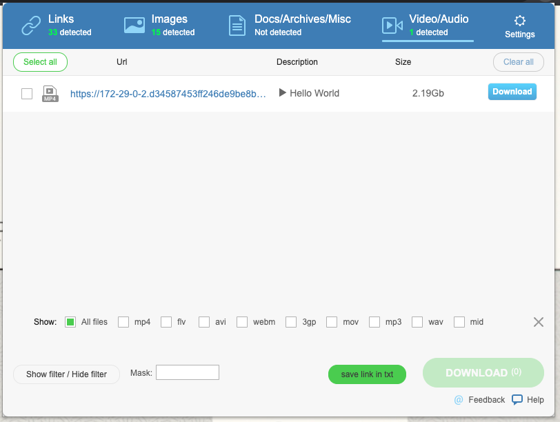

# Get Them All

## What is this

This is a Chrome Extension to download all elements on website supporting not only mp3, mp4, mov, gif, png but also m3u8 and a lot.

## Screenshot

## What to notice

I DO NOT CONFIRM THIS COPY IS SAFE

I been using this copy for 3 years or so. It should be safe but I DO_NOT promise you that. You can take over this copy and rewrite it if you like to. PRs are welcome.

## Why is this

This is a copy of GetThemAll from Google Chrome Extension Store.

I saved this copy as an accident. That day I was backing up my Chrome Extension localy to my hard drive and some weeks later,  I noticed this lovely extension was away from my Chrome.

Here is a backup I looked it up for 30 min in my backups.

## What about the license

Clearly, I dont have any license of this extension. If anything goes wrong, contact me in the issue and I will follow up asap.

## A little bit more

I have modified the manifest.json due some **Chrome Jobs** The Chome will not enable this if I dont do or simply delete it like the same way last time I lost it.

Enjoy - Lakr Aream - 2020 04 23
